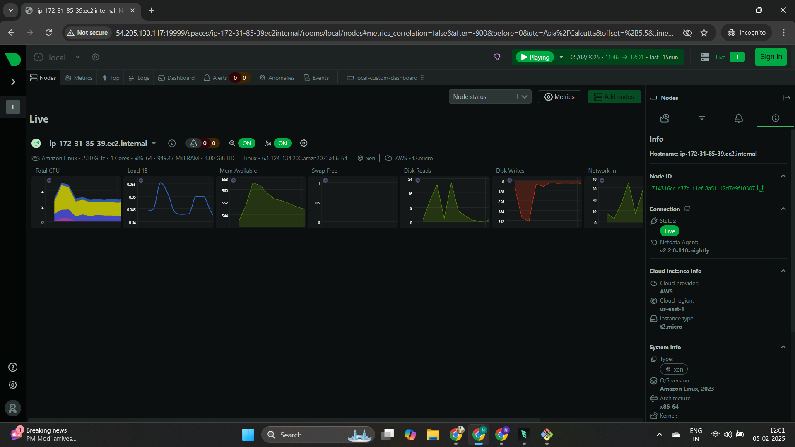
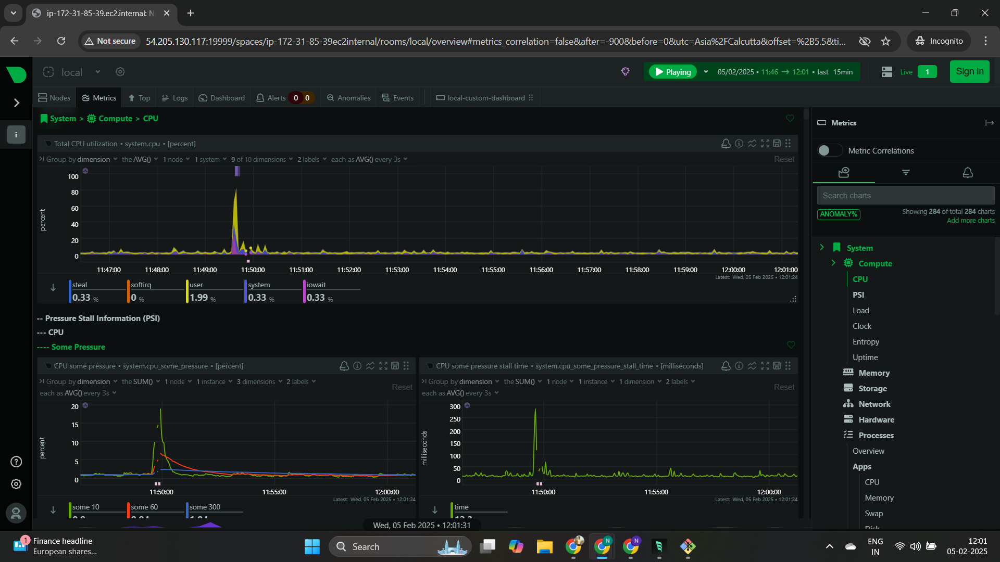
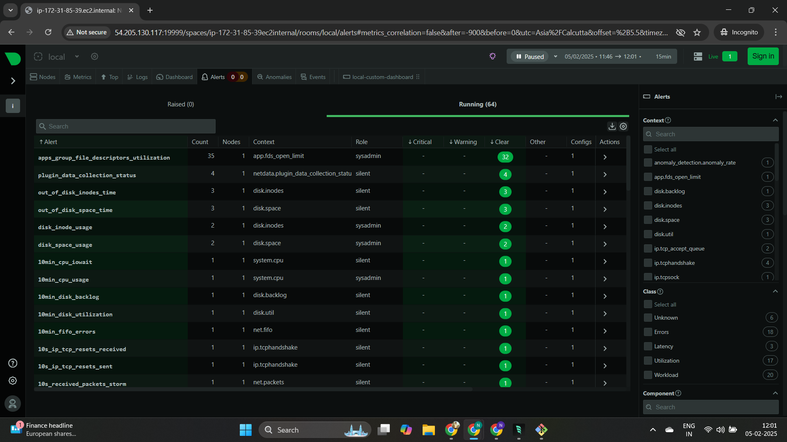
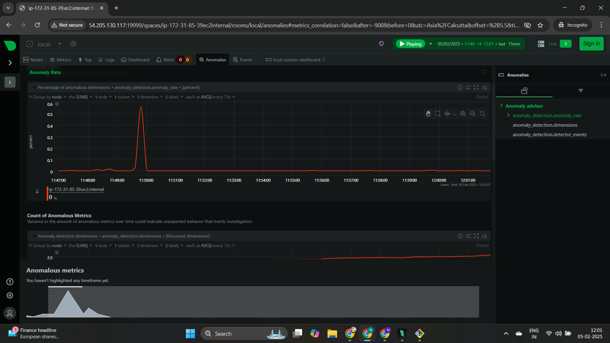
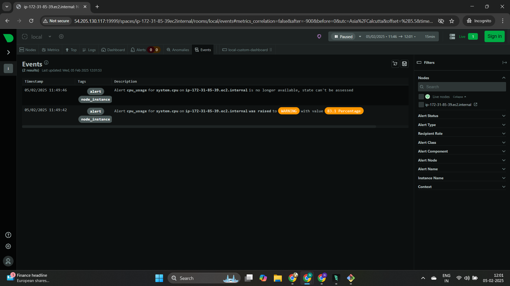

# Simple Monitoring Project

## Project Overview
This project implements a comprehensive monitoring dashboard using Netdata, following the requirements from [roadmap.sh](https://roadmap.sh/projects/simple-monitoring-dashboard). The goal is to help you learn the basics of system monitoring, understand how to monitor system health, and get acquainted with real-time performance tracking.

## Project Requirements

### 1. Dashboard Setup Using Netdata
- [x] Install Netdata on a Linux system
- [x] Configure Netdata to monitor core system metrics:
  - CPU usage
  - Memory usage
  - Disk I/O
- [x] Access the Netdata dashboard via web browser
- [x] Customize dashboard aspects (add/modify charts)
- [x] Set up alerts (e.g., CPU usage > 80%)

### 2. Custom Process Monitoring
- [x] Implemented process-specific monitoring:
  - System processes (sshd, netdata)
  - Web services (nginx, apache, httpd)
  - Database services (mysql, postgresql, mongodb)
  - Custom services (docker, containerd, kubelet)
- [x] Configured detailed metrics for each process:
  - CPU usage percentage
  - Memory usage (private and RSS)
  - Process status and uptime
  - Thread count
  - File descriptors

### 3. Automation & Scripting
- [x] setup.sh: Automates Netdata installation and custom configuration
- [x] test_dashboard.sh: Tests monitoring dashboard
- [x] cleanup.sh: Removes Netdata agent

### 4. Implemented Scripts

#### Setup Script (setup.sh)
- Automates Netdata installation on Amazon Linux
- Configures basic system monitoring
- Sets up CPU usage alerts
- Enables dashboard access
- Configures custom process monitoring
- Sets proper permissions for configuration files

#### Test Script (test_dashboard.sh)
- Generates test loads:
  - CPU stress testing
  - Disk I/O operations
  - Memory usage simulation
- Verifies monitoring functionality
- Checks alert triggering

#### Cleanup Script (cleanup.sh)
- Removes Netdata installation
- Cleans up configuration files
- Removes test tools
- Verifies complete removal

## Configuration Files

### apps_groups.conf
```conf
# Custom process groups for monitoring
system: sshd* netdata*
webserver: nginx* apache* httpd*
database: mysql* postgresql* mongod*
custom_services: docker* containerd* kubelet*
```

### apps.conf
```yaml
update_every: 1
priority: 60000

process_stats:
  name: 'System Process Stats'
  check_intervals: 1
  processes:
    sshd:
      command: 'sshd'
      metrics:
        - cpu
        - mem
        - threads
        - uptime
    netdata:
      command: 'netdata'
      metrics:
        - cpu
        - mem
        - threads
        - uptime
```

## Usage Instructions

1. Installation
```bash
chmod +x setup.sh
sudo ./setup.sh
```

2. Testing
```bash
chmod +x test_dashboard.sh
sudo ./test_dashboard.sh
```

3. Cleanup
```bash
chmod +x cleanup.sh
sudo ./cleanup.sh
```

## Access Dashboard
- Access via: http://YOUR_SERVER_IP:19999
- Default port: 19999
- Remember to configure security group/firewall rules

## Alert Configuration
- CPU Usage Alerts:
  - Warning: 80% usage
  - Critical: 90% usage

## Dashboard Features & Screenshots

### 1. Anomaly Detection

- Real-time anomaly rate monitoring
- Anomalous metrics tracking
- Automated detection and alerting
- Customizable detection thresholds

### 2. Event Monitoring

- Real-time event logging
- Alert status tracking
- System state changes
- Node-specific monitoring
- Customizable alert filters

### 3. Alert Management

- Comprehensive alert dashboard
- Multiple alert categories:
  - File descriptor utilization
  - Data collection status
  - Disk usage monitoring
  - CPU load tracking
  - Network metrics
- Role-based alert management (sysadmin, silent)
- Clear/Warning/Critical status tracking

### 4. System Performance

- CPU utilization graphs
- Pressure stall information (PSI)
- Multi-core performance tracking
- System load analysis
- Real-time performance metrics

### 5. Node Monitoring

- Live node status
- Resource utilization:
  - CPU usage
  - Memory availability
  - Disk I/O
  - Network traffic
- Cloud instance information
- System architecture details
- Real-time metrics visualization

These dashboards provide comprehensive monitoring capabilities with:
- Real-time data visualization
- Historical trend analysis
- Customizable alerts and thresholds
- System and process-level monitoring
- Resource utilization tracking
- Anomaly detection and reporting

## Custom Dashboard Features
1. Process Group Monitoring
   - System processes status and metrics
   - Web services performance
   - Database services health
   - Container and orchestration services

2. Real-time Metrics
   - Process-specific CPU usage
   - Memory utilization patterns
   - Thread management
   - Resource allocation

3. Performance Analytics
   - Historical data tracking
   - Resource usage patterns
   - System bottleneck identification

## Learning Outcomes
- Understanding of system monitoring basics
- Experience with automated setup and testing
- Foundation for advanced monitoring techniques
- Process-specific monitoring implementation
- Custom dashboard configuration
- Alert system setup and management

## Technical Requirements
- Amazon Linux or compatible distribution
- Root/sudo access
- Minimum 1GB RAM recommended
- Open port 19999 for dashboard access

## Future Enhancements
- [ ] Additional process group monitoring
- [ ] Enhanced metric collection
- [ ] Advanced alerting system
- [ ] Backup and restore functionality
- [ ] Custom visualization options
- [ ] Integration with external monitoring systems

## Project Source
This project is based on the ["Simple Monitoring"](https://roadmap.sh/projects/simple-monitoring-dashboard) project from roadmap.sh, designed to introduce developers to system monitoring concepts and practices. Enhanced with custom process monitoring and detailed metric collection capabilities.